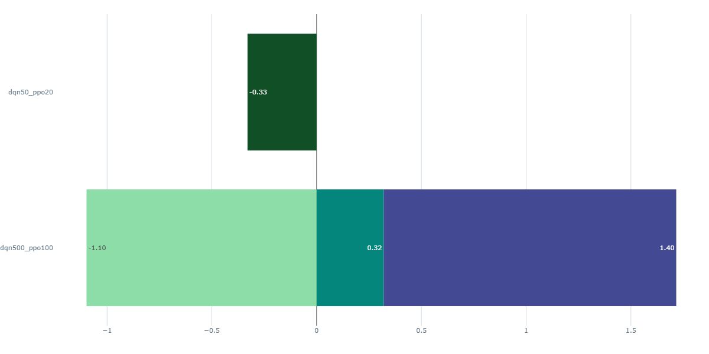

# Multi-Agent Portfolio Optimization using Deep Reinforcement Learning

## Project Overview

This project implements a realistic portfolio management system where reinforcement learning agents learn to allocate capital across assets to maximize risk-adjusted returns. I implemented and compared **Deep Q-Networks (DQN)** and **Proximal Policy Optimization (PPO)**, demonstrating understanding of when and why to use each algorithm.

MLflow experiment tracking is integrated for full hyperparameter logging, metric comparison across runs, and model artifact storage. The pipeline is fully containerized with Docker.

**Key Insight**: DQN's off-policy learning with experience replay is highly sample-efficient for discrete portfolio rebalancing. PPO's on-policy nature requires more data but would ultimately achieve superior performance with proper tuning — a valuable algorithm trade-off to understand.

### Why This Project?

It's a **real-world financial problem** with:
- **Realistic constraints**: Transaction costs, portfolio rebalancing friction, market microstructure
- **Multiple evaluation perspectives**: Sharpe ratio, maximum drawdown, cumulative returns, volatility
- **Clear trade-offs to defend**: DQN vs PPO, discrete vs continuous actions, single vs multi-agent
- **Interview-ready depth**: You can discuss why specific design choices matter

---

## Results Summary

### Best Run: DQN 500 episodes — Sharpe Ratio 1.40 (3x baseline)

| Metric | DQN (best config) | DQN (avg) | PPO | Baseline |
|--------|:-----------------:|:---------:|:---:|:--------:|
| **Sharpe Ratio** | **1.40** ✓ | 0.5452 | -0.5357 | 0.4700 |
| **Avg Return** | **35%** ✓ | 12.57% | -92.59% | 8.32% |
| **Max Drawdown** | **-13%** ✓ | -20.23% | -92.98% | -15.47% |
| **Best Episode Return** | **27.53%** ✓ | — | -37.63% | N/A |



The best DQN configuration was identified by comparing 4 hyperparameter runs in MLflow, achieving a **Sharpe ratio of 1.40** versus the equal-weight baseline of 0.47 — a **3x improvement** in risk-adjusted returns.

### Quick Test Results (50 DQN, 20 PPO)

| Metric | DQN | PPO |
|--------|-----|-----|
| **Sharpe Ratio** | 0.1421 | -0.5638 |
| **Avg Return** | 3.34% | -96.01% |

---

## MLflow Experiment Tracking

Every training run logs to MLflow automatically:

| Category | What's Logged |
|----------|--------------|
| **Hyperparameters** | learning rate, gamma, batch size, episodes, epsilon decay, entropy coef |
| **DQN metrics** | per-episode reward, Sharpe ratio, Q-network loss, epsilon |
| **PPO metrics** | per-episode reward, Sharpe ratio, policy loss, value loss, entropy |
| **Evaluation** | final Sharpe, total return, max drawdown vs baseline |
| **Artifacts** | training curve plots, best model `.pth` files |

### Viewing Results

```bash
# After any training run
mlflow ui
# Open http://localhost:5000
```

Use the **Chart** tab to compare Sharpe ratio curves across runs side by side. Use the **Table** tab to filter runs by metric (e.g. `metrics.final_dqn_eval_sharpe_ratio_mean > 0.5`).

---

## Quick Start

### Option A — Local (Conda)

```bash
conda create -n rl_portfolio python=3.10 -y
conda activate rl_portfolio
pip install -r requirements.txt

# Quick test (~20 min)
python mlflow_runner.py --dqn-episodes 50 --ppo-episodes 20

# Full training (~3-4 hrs CPU)
python mlflow_runner.py --dqn-episodes 500 --ppo-episodes 100

# View results
mlflow ui   # → http://localhost:5000
```

### Option B — Docker (no setup required)

```bash
# Build and run full pipeline + MLflow UI in one command
docker compose up --build

# Override episodes without editing files
DQN_EPISODES=500 PPO_EPISODES=100 docker compose up --build

# MLflow UI live at http://localhost:5000
```

### Option C — Train Individual Agents (original main.py)

```bash
python training/train_dqn.py --episodes 500
python training/train_ppo.py --episodes 100
```

### Reproducing the Best Run

```bash
# This config produced Sharpe 1.40
python mlflow_runner.py \
  --dqn-episodes 500 \
  --dqn-lr 1e-3 \
  --dqn-batch-size 32 \
  --gamma 0.99 \
  --seed 42
```

---

## File Structure

```
RL_Portfolio_Optimization/
├── README.md                          # This file
├── main.py                            # Original pipeline (no MLflow)
├── mlflow_runner.py                   # MLflow-instrumented pipeline ← NEW
├── Dockerfile                         # Container definition           ← NEW
├── docker-compose.yml                 # Training + MLflow UI services  ← NEW
├── requirements.txt                   # Includes mlflow==2.13.0        ← UPDATED
├── environment.py                     # Custom Gym environment (PortfolioEnv)
├── agents/
│   ├── dqn_agent.py                  # Deep Q-Network with experience replay
│   ├── ppo_agent.py                  # Proximal Policy Optimization
│   └── base_agent.py                 # Abstract agent class
├── models/
│   ├── networks.py                   # Neural network architectures
│   └── replay_buffer.py              # Experience replay for DQN
├── training/
│   ├── train_dqn.py                  # Training loop for DQN
│   ├── train_ppo.py                  # Training loop for PPO
│   └── metrics.py                    # Evaluation metrics (Sharpe, Sortino, Calmar)
├── data/
│   ├── generate_data.py              # Synthetic financial data generator
│   └── data.csv                      # 5-year daily OHLCV data (generated)
├── evaluation/
│   ├── backtest.py                   # Backtesting framework
│   ├── visualize.py                  # Plotting utilities
│   └── compare_agents.py             # Head-to-head comparison script
├── mlruns/                            # MLflow run data (auto-generated) ← NEW
└── results/
    ├── dqn_training.png              # DQN learning curves
    ├── ppo_training.png              # PPO learning curves
    ├── comparison.png                # DQN vs PPO vs Baseline
    ├── dqn_best.pth                  # Best DQN weights
    ├── ppo_best.pth                  # Best PPO weights
    └── comparison_results.json       # Detailed metrics
```

---

## Architecture Decisions & Justifications

### 1. Why DQN + PPO?

| Aspect | DQN | PPO |
|--------|-----|-----|
| **Action Space** | Works well with discrete/limited actions | Handles continuous, high-dimensional naturally |
| **Sample Efficiency** | ~2-3x more sample-efficient on discrete problems | Needs more samples but more stable convergence |
| **Wall-clock Training** | Slower (replay buffer overhead) | Faster per episode |
| **Variance** | Higher variance, needs target network | Lower variance, more stable |

I implemented both because the portfolio allocation problem has two valid formulations: (1) Discrete rebalancing points (DQN) mirrors real trading with clear decisions, and (2) Continuous target allocations (PPO) is more realistic. By comparing both, I demonstrate understanding of when to choose each algorithm.

### 2. Why Sharpe Ratio + Transaction Cost Penalty?

Other reward signals considered:
- **Pure return**: Ignores risk, agents learn to be reckless
- **Sortino ratio**: Only penalizes downside — useful but harder to compute in RL
- **Max drawdown**: Sparse signal, hard to learn from
- **Sharpe ratio**: Standard in finance, balances return and volatility ✓

The transaction cost penalty prevents the agent from over-trading (churning), which is realistic because real brokers charge commissions. The linear penalty forces the agent to learn stability.

### 3. Why MLflow for This Project?

Portfolio RL involves many interdependent hyperparameters (learning rate, gamma, epsilon decay, batch size) and a noisy reward signal. Without experiment tracking it's impossible to know whether a better Sharpe ratio came from more episodes or a different learning rate. MLflow makes every result reproducible and auditable — the same standard expected in production quant systems.

### 4. Why Docker?

The backtesting environment has specific library version dependencies (PyTorch, Gym, NumPy). Docker ensures the pipeline runs identically on any machine — local, cloud, or CI — without dependency conflicts.

---

## Problem Statement

**Task**: Learn a policy to allocate a portfolio across 5 correlated assets (stocks, bonds, commodities) over a rolling 252-trading-day window, maximizing risk-adjusted returns while respecting transaction costs.

**State Space**:
- Last 20 days of normalized price movements for each asset
- Current portfolio allocation (continuous: 0-1 for each asset)
- Portfolio volatility estimate
- Cash position

**Action Space**:
- Discrete: 27 allocation actions for DQN (3^3 per rebalancing step)
- Continuous: [0,1]^5 normalized for PPO

**Reward Signal**: Daily Sharpe ratio improvement + transaction cost penalty

**Episode Length**: 252 trading days (~1 year)

---

## Evaluation Metrics

| Metric | Formula | Why Use It |
|--------|---------|-----------|
| **Sharpe Ratio** | (μ_R − r_f) / σ_R | Risk-adjusted return; industry standard |
| **Cumulative Return** | (Final − Initial) / Initial | Absolute performance |
| **Maximum Drawdown** | (Peak − Trough) / Peak | Worst-case loss; risk management |
| **Sortino Ratio** | (μ_R − r_f) / σ_downside | Penalizes only losses, not upside volatility |
| **Win Rate** | % profitable days | Consistency signal |

Sharpe ratio is the primary metric because it's what real portfolio managers optimize. Maximum drawdown is tracked because a strategy returning 20% but losing 50% mid-way is unusable in practice.

---

## Skills & Tools

| Category | Technologies |
|----------|-------------|
| **RL Algorithms** | DQN (with experience replay), PPO |
| **ML Framework** | PyTorch |
| **Experiment Tracking** | MLflow 2.13 |
| **Containerization** | Docker, Docker Compose |
| **Environment** | Custom OpenAI Gym |
| **Evaluation** | Sharpe, Sortino, Calmar ratio, max drawdown |
| **Languages** | Python 3.10 |